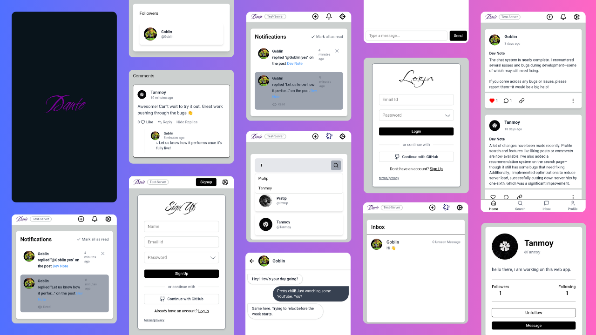

<div align="left" style="position: relative;">
<h1>SOCIALMEDIA</h1>
	Welcome to the Dante, a full-featured social media platform built with modern web development tools and designed for experimentation, learning, and showcasing social networking functionalities. This project is suitable for developers who want to understand how social platforms operate, from user authentication to real-time chat systems.

<p align="left">
	
	
	
	
</p>
<p align="left">Built with the tools and technologies:</p>
<p align="left">
	
	
	
	
	
	
	
	
	
	
	
</p>
</div>
<br clear="right">

## 🔗 Table of Contents

- [🌐 Live Demo](#-live-demo)
- [📱 Overview](#-overview)
- [✨ Features](#-features)
- [🚀 Tech Stack](#-tech-stack)
- [📁 Folder Structure](#-folder-structure)
- [🗄️ Database Structure](#-database-structure)
- [⚙️ Installation & Setup](#-installation-&-setup)
  - [☑️ Prerequisites](#-prerequisites)
  - [⚙️ Installation](#-installation)
  - [🛠️ Setting Up Appwrite Functions](#-🛠️-setting-up-appwrite-functions)
- [📌 Project Roadmap](#-project-roadmap)
- [🔰 Contributing](#-contributing)
- [📄 License](#-license)
- [👤 Author](#-author)

---

## 🌐 Live Demo

Check out the live demo of this project here:
👉 [dantetestserver.pages.dev](https://dantetestserver.pages.dev)

---

## 📱 Overview



---

## ✨ Features

* User Authentication (Login/Signup)
* Profile Creation & Editing
* Post Creation, Editing, and Deletion
* Like and Comment Functionality
* Real-Time Chat System
* Notifications (Locally cached using IndexedDB)
* Responsive Design for Mobile and Desktop
* Custom React Hooks and Redux Toolkit for state management

---

## 🚀 Tech Stack

* **Frontend:** React.js, Redux Toolkit, Tailwind CSS
* **Backend & Database:** Appwrite (self-hosted backend-as-a-service)
* **Realtime Messaging:** Custom Chat Service
* **Data Storage:** IndexedDB for local notifications and data caching
* **Deployment:** Cloudflare Pages

---

## 📁 Folder Structure

```sh
└── SocialMedia/
	├── LICENSE
	├── SocialMedia/
	│	├── public/              # Static assets
	│	├── src/
	│	│   ├── app/             # Redux store and configuration
	│	│   ├── assets/          # Images and icons
	│	│   ├── components/      # Shared components (Navbar, Button, etc.)
	│	│   ├── features/        # Feature-based Redux slices
	│	│   ├── pages/           # Page components (Home, Profile, Chat, etc.)
	│	│   ├── services/        # API and backend interactions
	│	│   ├── utils/           # Utility functions and hooks
	│	│   └── main.jsx         # React DOM root
	│	├── .env                 # Environment variables
	│	├── package.json         # Project metadata and scripts
	│	└── tailwind.config.js   # Tailwind CSS configuration
	└── appwriteFunctions        # Appwrite functions
		├── commentFunction
		│   └── src
		│       └── main.js      # Appwrite functions for comment system
		└── followFunction
		    └── src
		        └── main.js      # Appwrite functions for follow unfollow
```

### 🗄️ Database Structure

```sh
└── Database

	├── UserProfileCollection
	│   ├── Fields: username*, bio, avatarUrl
	│   └── Permissions:
	│       ├── Any:        X R X X
	│       └── Users:      C R W D

	├── PostCollection
	│   ├── Fields: userId*, content, mediaUrl, likesCount, visibility, title*, commentsCount
	│   └── Permissions:
	│       ├── Any:        X R X X
	│       └── Users:      C R W D

	├── ReportCollection
	│   ├── Fields: userId*, postId, reportText*
	│   └── Permissions:
	│       ├── Dev:        C R W D
	│       └── Users:      C X X X

	├── CommentsCollection
	│   ├── Fields: commentId, postId*, authorId*, content*, likesCount
	│   ├── Accessed By: Function { postId, commentId = null, content }
	│   └── Permissions:
	│       ├── Any:        X R X X
	│       └── Users:      X X X X

	├── FollowersStats
	│   ├── Fields: Document ID, followersCount, followingCount
	│   ├── Accessed By: Function { followeeId }
	│   └── Permissions:
	│       ├── Any:        X R X X
	│       └── Users:      X X X X

	├── FollowsEvent
	│   ├── Fields: followerId*, followeeId*
	│   ├── Accessed By: Function { followeeId }
	│   └── Permissions:
	│       ├── Any:        X R X X
	│       └── Users:      X X X X

	├── Notifications
	│   ├── Fields: userId, type(comment|follow|replay), relatedUserId, relatedPostId, seen, commentText
	│   ├── Accessed By:
	│       ├── Function { followeeId }
	│       └── Function { postId, commentId = null, content }
	│   └── Permissions:
	│       └── User($ID):  X R W D

	├── LikesCollection          # Requires custom access control via an Appwrite Function
	│   ├── Fields: userId*, postId*, commentId
	│   ├── Notes: Needs to be secured via custom function
	│   └── Permissions:
	│       ├── Any:        X R X X
	│       └── Users:      C R X D

	├── InboxCollection          # Requires custom access control via an Appwrite Function
	│   ├── Fields: senderId, receiverId, message, seen
	│   ├── Notes: Must be secured with custom function
	│   └── Permissions:
	│       ├── Any:        X R U X
	│       └── Users:      C R U D
```

Legend:

* `C` = Create
* `R` = Read
* `W` = Write
* `D` = Delete
* `X` = No permission
* `*` = Required field


## ⚙️ Installation & Setup

### ☑️ Prerequisites

Before getting started with SocialMedia, ensure your runtime environment meets the following requirements:

- **Programming Language:** JavaScript
- **Package Manager:** Npm


### ⚙️ Installation

Install SocialMedia using one of the following methods:

1. **Clone the Repository**

   ```bash
   git clone https://github.com/Tanmoy-Mondal-07/SocialMedia.git
   cd SocialMedia
   ```

2. **Install Dependencies**

   ```bash
   npm install
   ```

3. **Setup Environment Variables**
   Create a `.env` file in the root directory and add your Appwrite project credentials:

	```env
	# Appwrite Project Configuration
	VITE_APPWRITE_URL=                      # The endpoint URL of your Appwrite server
	VITE_APPWRITE_PROJECT_ID=              # Your Appwrite project ID
	VITE_APPWRITE_DATABASE_ID=             # The ID of your Appwrite database

	# Collection IDs
	VITE_APPWRITE_USER_PROFILE_COLLECTION_ID=     # Collection for user profile data
	VITE_APPWRITE_POST_COLLECTION_ID=             # Collection for posts
	VITE_APPWRITE_FOLLOW_STATE_COLLECTION_ID=     # Collection to track follow state between users
	VITE_APPWRITE_FOLLOW_EVENT_COLLECTION_ID=     # Collection for follow/unfollow events
	VITE_APPWRITE_COMMENTS_COLLECTION_ID=         # Collection for post comments
	VITE_APPWRITE_NOTIFICATIONS_COLLECTION_ID=    # Collection for user notifications
	VITE_APPWRITE_REPORT_COLLECTION_ID=           # Collection for content reports (e.g., abuse or spam)
	VITE_APPWRITE_LIKE_COLLECTION_ID=             # Collection for likes on posts or comments
	VITE_APPWRITE_INBOX_COLLECTION_ID=            # Collection for private chat or messaging inboxes

	# Bucket IDs
	VITE_APPWRITE_BUCKET_AVATAR_ID=               # Storage bucket for user avatars

	# Function IDs
	VITE_APPWRITE_FOLLOW_FUNCTION_ID=             # Function to handle follow/unfollow logic
	VITE_APPWRITE_COMMENT_FUNCTION_ID=            # Function to handle comment creation/processing
	```

4. **Run the Development Server**

   ```bash
   npm run dev
   ```

5. **Build for Production**

   ```bash
   npm run build
   ```
### 🛠️ Setting Up Appwrite Functions

1. **Create a New Appwrite Function**
   Go to your Appwrite dashboard and create a new function.

2. **Replace the `main.js` File**
   After creating the function, replace the default `main.js` file with your custom version.

	```bash
	└── Function/                 # Appwrite Function repository
	    ├── node_modules/...
	    ├── src/
	    │   └── main.js           # Replace this file with your custom main.js
	    ├── package.json
	    └── package-lock.json
	```

3. **Configure Environment Variables and Permissions**
   Don’t forget to set the required environment variables and configure the appropriate permissions for your Appwrite function.

4. **Learn More**
   To understand Appwrite functions in more detail, refer to the following resources:

   * [YouTube Guide](https://www.youtube.com/watch?v=UAPt7VBL_T8&list=PL-nc7zI7zjsbGzYBiG_V3tEFpmlzzbJgC)
   * [Official Documentation](https://appwrite.io/docs/products/functions/quick-start)

---
## 📌 Project Roadmap

- [X] **`Task 1`**: <strike>The follow system must be secured using a custom Appwrite function to validate user actions and prevent unauthorized follows.</strike>
- [X] **`Task 2`**: <strike>The comment system must be secured using a custom Appwrite function to ensure only authenticated users can post, edit, or delete comments.</strike>
- [*] **`Task 3`**: The live chat system must be secured using a custom Appwrite function to ensure message integrity and user authentication.
- [*] **`Task 4`**: The like system must be secured using a custom Appwrite function to prevent duplicate likes and ensure actions are tied to authenticated users..

---

## 🔰 Contributing

Contributions are welcome! If you'd like to contribute:

1. **Fork the Repository**: Start by forking the project repository to your github account.
2. **Clone Locally**: Clone the forked repository to your local machine using a git client.
   ```sh
   git clone https://github.com/Tanmoy-Mondal-07/SocialMedia
   ```
3. **Create a New Branch**: Always work on a new branch, giving it a descriptive name.
   ```sh
   git checkout -b new-feature-x
   ```
4. **Make Your Changes**: Develop and test your changes locally.
5. **Commit Your Changes**: Commit with a clear message describing your updates.
   ```sh
   git commit -m 'Implemented new feature x.'
   ```
6. **Push to github**: Push the changes to your forked repository.
   ```sh
   git push origin new-feature-x
   ```
7. **Submit a Pull Request**: Create a PR against the original project repository. Clearly describe the changes and their motivations.
8. **Review**: Once your PR is reviewed and approved, it will be merged into the main branch. Congratulations on your contribution!
</details>

<details closed>
<summary>Contributor Graph</summary>
<br>
<p align="left">
   <a href="https://github.com/Tanmoy-Mondal-07/SocialMedia/graphs/contributors">
      
   </a>
</p>
</details>

---

## 📄 License

This project is licensed under the **MIT License**. See the [LICENSE](./LICENSE) file for details.

---

## 👤 Author

**Tanmoy Mondal**

GitHub: [@Tanmoy-Mondal-07](https://github.com/Tanmoy-Mondal-07)

---

## ❓ Support

If you find any bugs or issues, please open an issue on GitHub or reach out via the Issues tab.

Happy Coding! ✨